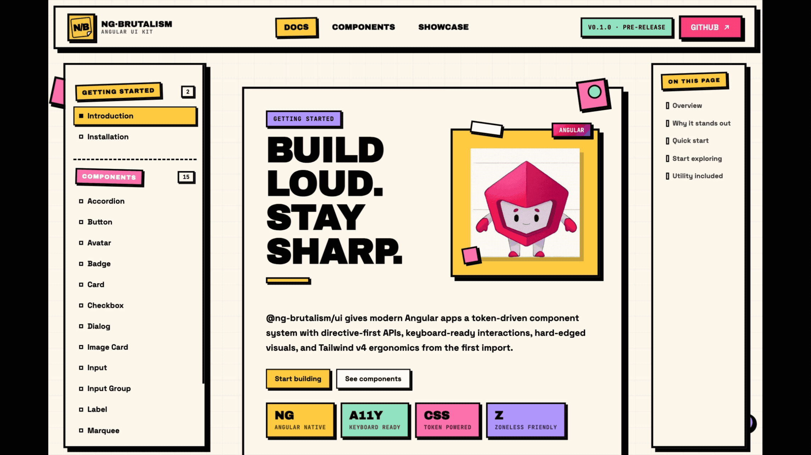
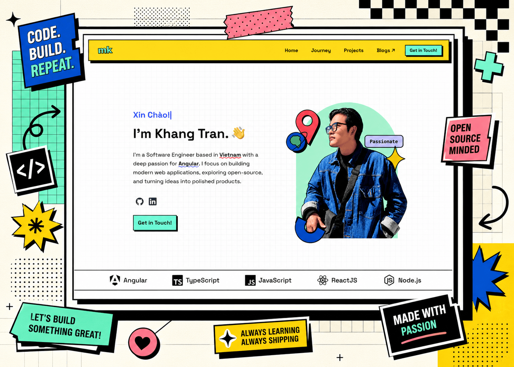

# @ng-brutalism/ui

Build loud. Stay sharp.

`@ng-brutalism/ui` gives modern Angular apps a token-driven component system
with directive-first APIs, keyboard-ready interactions, hard-edged visuals, and
Tailwind v4 ergonomics from the first import.

[](https://www.npmjs.com/package/@ng-brutalism/ui)
[](https://www.npmjs.com/package/@ng-brutalism/ui)
[](https://github.com/khangtrannn/ng-brutalism/actions/workflows/ci.yml)
[](https://github.com/khangtrannn/ng-brutalism/blob/main/LICENSE)

[Documentation](https://ngbrutalism.khangtran.dev) ·
[npm](https://www.npmjs.com/package/@ng-brutalism/ui) ·
[GitHub](https://github.com/khangtrannn/ng-brutalism)



## Install

Requires Node 20.19+ or 22.12+, Angular 21, and Tailwind CSS v4.

```sh
npm install @ng-brutalism/ui
# or
pnpm add @ng-brutalism/ui
```

Import the styles once in your global CSS:

```css
@import '@ng-brutalism/ui/styles.css';
```

Use a component:

```ts
import { Component } from '@angular/core';
import { NbButton } from '@ng-brutalism/ui';

@Component({
  selector: 'app-root',
  imports: [NbButton],
  template: `<button nbButton>Click</button>`,
})
export class App {}
```

## Why it stands out

- **Angular first**: Built as Angular primitives with directive APIs,
  signal-friendly internals, and native interaction patterns that fit modern
  Angular apps.
- **Loud by default**: Chunky borders, offset shadows, punchy color, and compact
  motion make interfaces feel instantly brutalist.
- **Easy to bend**: CSS custom properties and Tailwind utilities keep theme
  overrides local, visible, and predictable.

Optional — configure a subset of theme tokens from TypeScript at bootstrap.
Sets the corresponding `--nb-*` custom properties for these keys. Tokens
outside `NbThemeConfig` (e.g. `--nb-background`, `--nb-field-bg`) must still be
overridden in CSS.

```ts
import { provideNgBrutalism } from '@ng-brutalism/ui';

bootstrapApplication(AppComponent, {
  providers: [
    provideNgBrutalism({
      theme: {
        primary: '#ffd166',
        radius: '4px',
        borderWidth: '3px',
      },
    }),
  ],
});
```

[Full installation guide →](https://ngbrutalism.khangtran.dev/docs/installation)

## What it looks like



## Status

`@ng-brutalism/ui` is pre-1.0. The component APIs are usable today, but minor
versions may include breaking changes while the library settles.

## License

MIT
