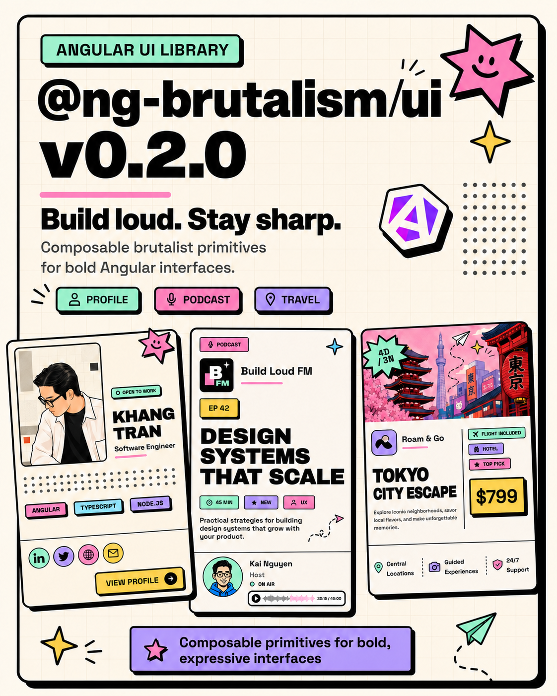

# ng-brutalism — Neo-brutalist Angular UI Primitive Library

Build loud. Stay sharp.

ng-brutalism is a neo-brutalist Angular UI primitive library and composition
system for building loud, token-driven Angular interfaces with directive-first
APIs, signals, zoneless-friendly patterns, Tailwind CSS v4, chunky borders,
offset shadows, and punchy colors.

If you like shadcn/ui or daisyUI, but for Angular and built around brutalism.

[](https://www.npmjs.com/package/@ng-brutalism/ui)
[](https://www.npmjs.com/package/@ng-brutalism/ui)
[](https://github.com/khangtrannn/ng-brutalism/actions/workflows/ci.yml)
[](https://github.com/khangtrannn/ng-brutalism/blob/main/LICENSE)

[Documentation](https://ngbrutalism.khangtran.dev) ·
[npm](https://www.npmjs.com/package/@ng-brutalism/ui) ·
[GitHub](https://github.com/khangtrannn/ng-brutalism)



## What's new in v0.2.0

v0.2.0 ships a full composition system. The new layout grammar — **Surface, Section, Stack, Cluster, and Split** — lets you compose complete card layouts, multi-column pages, and recipe UIs entirely from library primitives with consistent token-driven spacing, border, shadow, and typography.

New primitives: `NbSurface`, `NbSection`, `NbStack`, `NbCluster`, `NbSplit`, `NbMediaFrame`, `NbText`, `NbDisplay`, `NbStat`, `NbRating`, `NbProgress`, `NbStatusDot`, `NbCallout`, `NbMediaItem`, `NbAvatarGroup`, `NbChip`, `NbChipGroup`, `NbIconButton`, `NbSticker`, `NbHalftone`, `NbSeparator` — plus three copy-paste composition recipes in the docs.

See [CHANGELOG.md](CHANGELOG.md) for full details and [migration notes](#migrating-from-v01x).

## Install

Requires Node 20.19+ or 22.12+, Angular 21, and Tailwind CSS v4.

Automatic setup:

```sh
ng add @ng-brutalism/ui
```

The schematic installs the package, configures Tailwind CSS v4 when needed, and
adds the bundled styles to your global stylesheet.

Manual setup:

```sh
npm install @ng-brutalism/ui
# or
pnpm add @ng-brutalism/ui
```

Import the styles once in your global CSS:

```css
@import 'tailwindcss';
@import '@ng-brutalism/ui/styles.css';
```

`styles.css` bundles every component. To ship only the CSS you use, import
`base.css` (tokens, tone, reset — required once) plus one stylesheet per
component instead:

```css
@import 'tailwindcss';
@import '@ng-brutalism/ui/base.css';    /* required */
@import '@ng-brutalism/ui/button.css';  /* only what you use */
@import '@ng-brutalism/ui/card.css';
```

Each component ships its own stylesheet at `@ng-brutalism/ui/<name>.css`
(e.g. `button.css`, `card.css`, `input-group.css`, `native-select.css`). The
stylesheets are self-contained — `base.css` is the only shared dependency.

Use a component:

```ts
import { Component } from '@angular/core';
import { NbButton } from '@ng-brutalism/ui';

@Component({
  selector: 'app-root',
  imports: [NbButton],
  template: `<button nbButton>Click</button>`,
})
export class App {}
```

## Why it stands out

- **Angular first**: Built as Angular primitives with directive APIs,
  signal-friendly internals, and native interaction patterns that fit modern
  Angular apps.
- **Loud by default**: Chunky borders, offset shadows, punchy color, and compact
  motion make interfaces feel instantly brutalist.
- **Easy to bend**: CSS custom properties and Tailwind utilities keep theme
  overrides local, visible, and predictable.

Theming is CSS-only: redefine the `--nb-*` custom properties in your own
stylesheet, after the library's `theme.css` import.

```css
@import '@ng-brutalism/ui/styles.css';

:root {
  --nb-primary: #ffd166;
  --nb-radius: 4px;
  --nb-border-width: 3px;
}
```

`provideNgBrutalism()` registers library providers and takes no theme config.

```ts
import { provideNgBrutalism } from '@ng-brutalism/ui';

bootstrapApplication(AppComponent, {
  providers: [provideNgBrutalism()],
});
```

[Full installation guide →](https://ngbrutalism.khangtran.dev/docs/installation)

## Primitive System

ng-brutalism is a composition system, not just a component list. Use primitives
like `nbSurface`, `nbSection`, `nbSplit`, `nbStack`, and `nbCluster` as the
layout grammar. Add emphasis with `nbChip`, `nbCallout`, `nbSticker`, and
`nbStatusDot`. Finish with typography, media, forms, and action primitives.

Inputs are for common design decisions. CSS variables are for local art
direction. Classes are for layout escape hatches.

| Group                  | Primitives                                                              |
| ---------------------- | ----------------------------------------------------------------------- |
| Foundation             | Tokens, theme provider, CSS variables                                   |
| Layout                 | Stack, Cluster, Split, Section, Separator                               |
| Surfaces               | Surface, Card, Image Card, Media Frame                                  |
| Typography             | Text, Display, Title                                                    |
| Emphasis               | Badge, Chip, Callout, Sticker, Status Dot, Rating, Progress, Halftone  |
| Actions                | Button, Icon Button, Button Trailing Icon                               |
| Media                  | Avatar, Avatar Group, Icon, Media Item, Stat                            |
| Forms                  | Input, Input Group, Textarea, Checkbox, Select, Label                   |
| Overlays / Interaction | Accordion, Dialog, Marquee                                              |
| Recipes                | Travel Card, Podcast Card, Open to Work Card                            |

## Compositions

Three recipes are copy-paste compositions in the docs, not package exports — each assembled entirely from library primitives:

<p>
  
  
  
</p>

## FAQ

**Does ng-brutalism support Angular 21?**
Yes — it is built and tested against Angular 21. Earlier Angular versions are not supported.

**Do I need Tailwind CSS v4?**
Yes. ng-brutalism is built around Tailwind CSS v4 and CSS custom properties. It ships with an Angular CLI schematic that helps you get the required styling setup ready out of the box.

**Can I use ng-brutalism without zoneless mode?**
Yes. Components are designed for modern Angular: standalone imports, signal-friendly internals, and zoneless-friendly interaction patterns. They work in zoneless apps and in apps that still run with zone.js.

**Does ng-brutalism work with server-side rendering (SSR)?**
The UI package avoids browser-only assumptions in core primitives where possible, and browser-dependent behavior is kept behind Angular platform checks when needed.

**How customizable is the theme?**
All visual tokens are exposed as CSS custom properties (`--nb-*`). Theming is CSS-only — redefine them in your own stylesheet, or swap in one of the `theme-*.css` presets.

**Is ng-brutalism ready for production?**
It is pre-1.0. Component APIs are usable today, but minor versions may include breaking changes while the library settles.

## Migrating from v0.1.x

v0.2.0 contains breaking changes. The `Component`/`Directive` suffix was dropped from all exported names: `NbCardComponent` → `NbCard`, `NbButtonDirective` → `NbButton`, `NbSelectComponent` → `NbSelect`, etc. The `defaultValue` / `defaultOpen` inputs on `<nb-accordion>` and `<nb-select>` were removed in favour of `[value]` / `[(value)]` bindings. `NbSection`'s `border` input was renamed to `divider`.

See [CHANGELOG.md](CHANGELOG.md) for the complete list.

## Author

Created by [Khang Tran](https://github.com/khangtrannn). MIT licensed. Source code is available on GitHub.

## Status

`@ng-brutalism/ui` is pre-1.0. The component APIs are usable today, but minor
versions may include breaking changes while the library settles.

## Contributing

Issues and pull requests are welcome. See [CONTRIBUTING.md](CONTRIBUTING.md) for details.

## License

MIT
