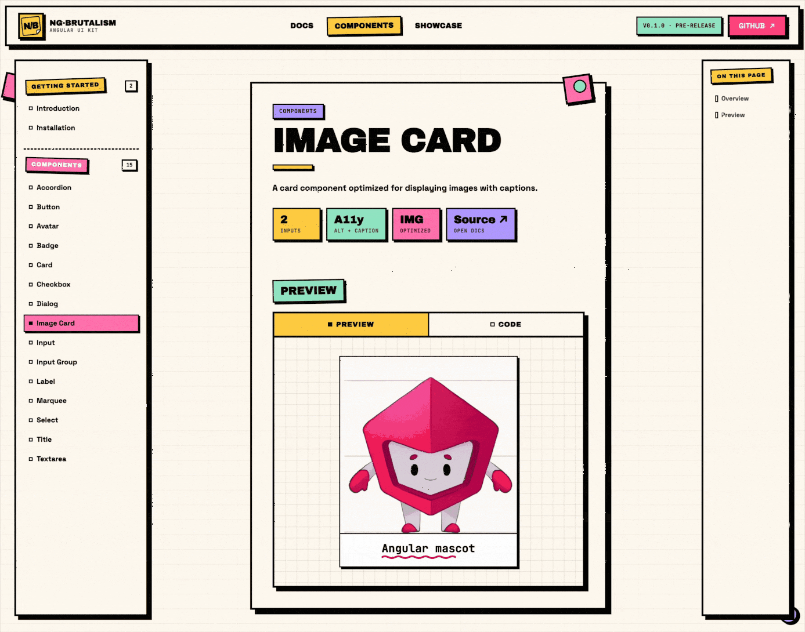

# Release Decisions — `@ng-brutalism/ui` v0.1.0

Companion to [RELEASE_PLAN.md](./RELEASE_PLAN.md). Captures grill-session decisions
on 2026-05-20 and supersedes the plan where they conflict.

When resuming: Pass 1 release-plumbing decisions are locked. Start
implementation from § 3 Order of operations, then verify with the Pass 1 command
listed there.

Current checkpoint for next session:
- Do **Pass 1 — release plumbing** only.
- Do **not** draft README / CONTRIBUTING / CHANGELOG yet; those are Pass 2.
- Keep `RELEASE_DECISIONS.md` at the repo root until v0.1.0 is published.
- Assume `docs/assets/image-card-demo.gif` will be provided later by the user;
  use the final path in docs/copy, but do not block Pass 1 on recording it.
- `origin` remote has already been verified as
  `https://github.com/khangtrannn/ng-brutalism.git`.
- After Pass 1, run
  `pnpm nx run-many -t lint test build --projects=ui,docs`.

---

## 1. Reality check — items struck from RELEASE_PLAN.md

Verified done in code on 2026-05-20. Ignore the corresponding section of the plan.

| Plan ref | Item | Evidence |
|---|---|---|
| §1.2 | `libs/ui/README.md` rewritten (no longer Nx stub) | Current file has install / styles / usage / optional provider / license sections |
| §1.6 | Density tokens removed | `NB_DENSITY` / `NbDensity` / `density.tokens.ts` absent from `libs/ui/src/` |
| §1.7 | `NbSelect` → `NbNativeSelect` rename | `libs/ui/src/index.ts:45` |
| §1.8 | `NbDialogComponent` alias dropped from public API | Only `NbDialog` exported from root `index.ts:54` |
| §1.9 | `NbSelectSize` removed | Not exported from root `index.ts` |
| §1.10 | Input-group internals hidden | `libs/ui/src/lib/input-group/index.ts` exposes only the three components + two align types |
| §2.1 | Card page selectors corrected | `apps/docs/src/app/pages/components/card.page.ts:118-178` uses `nb-card*` |

Several §2.x docs items likely also resolved by recent commits (`980c09a`,
`3038128`, `50ffed1`, `f0631bc`, `be37fc9`, `9da2809`, `983152b`). Spot-check
during the §4.3 docs build smoke; do not pre-fix without verification.

---

## 2. Locked decisions

### 2.1 Repository & domain

- **GitHub repo renamed** to `khangtrannn/ng-brutalism` (user-confirmed; local
  `origin` remote verified on 2026-05-20 as
  `https://github.com/khangtrannn/ng-brutalism.git` for fetch and push).
- **Docs hosting**: GitHub Pages with custom domain `ngbrutalism.khangtran.dev`.
- **CNAME file timing**: add `apps/docs/public/CNAME` in Pass 1, before DNS
  and Pages are fully configured, so the first GitHub Actions deploy already
  carries the custom-domain declaration.
- **DNS**: Cloudflare. The `ngbrutalism` CNAME → `khangtrannn.github.io` must
  have **proxy OFF** (grey cloud), or GitHub's Let's Encrypt cert issuance
  silently fails.
- **No GitHub org** for v0.1.0. Stays on personal account `khangtrannn`.

### 2.2 Library package metadata

- **Version**: direct `0.1.0`. No RC. Marketing concerns addressed via thorough
  smoke testing rather than dist-tag staging.
- **License**: MIT.
- **`author`**: `"Khang Tran <khangtrann8198@gmail.com>"`.
- **Fix §1.1 stale exports**: in `libs/ui/package.json`, **remove** the
  `esm2022` and `esm` conditions entirely. They point at non-existent files
  with an outdated `ng-neo-brutalism-ui.mjs` name. The `default` (fesm2022) +
  `types` entries are sufficient — modern bundlers will resolve correctly.
- **Add publish metadata** (description, license, repository, homepage, bugs,
  keywords, author). See § 4.1 for the full delta.
- **Pack via `files` whitelist** rather than `.npmignore` — open question § 6.

### 2.3 Docs site

- **Static prerendering, not SSR.** GitHub Pages is static-only; Analog
  prerender provides SSG at build time. LAUNCH.md Phase 5's SSR smoke check
  becomes a prerender-completes-without-error check.
- **Prerender route list must be expanded** to every page that ships:
  - All `/components/*` (16 components — currently lists 5)
  - All `/docs/*` siblings (currently lists 6)
  - `/showcase/portfolio`
  - Index pages (`/`, `/components`, `/docs`, `/installation`, `/introduction`)
  - Roughly **22-25 routes total**.
- Routes outside the prerender list will 404 on direct navigation, including
  links from LinkedIn / Google / OG previews. No SPA-fallback hack — it kills
  SEO and OG metadata.
- **Implementation decision**: hardcode the full prerender route list for
  v0.1.0. The route count is small and explicit config is easier to audit before
  launch than filesystem-derived route generation.

  ```ts
  const prerenderRoutes = [
    '/',
    '/components',
    '/components/accordion',
    '/components/avatar',
    '/components/badge',
    '/components/button',
    '/components/card',
    '/components/checkbox',
    '/components/dialog',
    '/components/image-card',
    '/components/input',
    '/components/input-group',
    '/components/label',
    '/components/marquee',
    '/components/select',
    '/components/textarea',
    '/components/title',
    '/docs',
    '/docs/introduction',
    '/docs/installation',
    '/docs/accordion',
    '/docs/avatar',
    '/docs/badge',
    '/docs/button',
    '/docs/card',
    '/docs/checkbox',
    '/docs/dialog',
    '/docs/image-card',
    '/docs/input',
    '/docs/input-group',
    '/docs/label',
    '/docs/marquee',
    '/docs/select',
    '/docs/textarea',
    '/docs/title',
    '/showcase/portfolio',
  ];
  ```

### 2.4 CI / CD

Two workflow files. No `release.yml`, no Dependabot for v0.1.0.

**`.github/workflows/ci.yml`** — runs on PRs:

```yaml
name: CI
on:
  pull_request:
    branches: [main]
  workflow_dispatch:

jobs:
  verify:
    runs-on: ubuntu-latest
    steps:
      - uses: actions/checkout@v4
        with: { fetch-depth: 0 }
      - uses: pnpm/action-setup@v4
      - uses: actions/setup-node@v4
        with: { node-version: 22, cache: pnpm }
      - run: pnpm install --frozen-lockfile
      - run: pnpm nx affected -t lint test build --base=origin/main
```

**`.github/workflows/deploy-docs.yml`** — runs on push to `main`:

```yaml
name: Deploy docs
on:
  push:
    branches: [main]
  workflow_dispatch:

concurrency:
  group: pages
  cancel-in-progress: true

permissions:
  contents: read
  pages: write
  id-token: write

jobs:
  build-deploy:
    runs-on: ubuntu-latest
    steps:
      - uses: actions/checkout@v4
        with: { fetch-depth: 0 }
      - uses: pnpm/action-setup@v4
      - uses: actions/setup-node@v4
        with: { node-version: 22, cache: pnpm }
      - run: pnpm install --frozen-lockfile
      - run: pnpm nx run-many -t lint test --projects=ui,docs
      - run: pnpm nx build docs --configuration=production
      - uses: actions/upload-pages-artifact@v3
        with:
          path: dist/apps/docs/client
      - uses: actions/deploy-pages@v4
```

**Why split** — `affected` on PRs (fast slice), `run-many` on main (full
verification before deploy). Avoids the workflow_call indirection until needed.

**GitHub repo settings prerequisite**: Settings → Pages → Build and deployment
**source = "GitHub Actions"** (not "Deploy from a branch"). Without this, the
deploy step fails confusingly.

**CI checkout depth**: use `fetch-depth: 0` in `ci.yml` too. `nx affected`
needs enough git history to compare against `origin/main`; the slightly slower
checkout is worth avoiding confusing first-PR failures.

### 2.5 Branch protection — flipped *after* v0.1.0 publishes

Settings → Branches → main, when the time comes:

- ✅ Require pull request before merging
- ✅ Require status checks to pass — pick `CI / verify`
- ⬜ Require approvals (off — solo)
- ⬜ Require linear history (off)
- ⬜ Include administrators (off — keep an escape hatch)

The v0.1.0 prep itself ships via direct commits to `main`; the very next change
*after* publishing is the first PR.

### 2.6 README + visual assets

- **Split README**: root README becomes a public-facing pitch (~30 lines);
  monorepo commands + contributor guidance move to `CONTRIBUTING.md`.
- **Root README structure**:

  ```markdown
  # @ng-brutalism/ui

  [one-line elevator pitch]

  

  📚 Docs · 📦 npm · ⭐ GitHub

  ## Install
  [3-line snippet]

  ## What it looks like
  

  ## Status — v0.x
  Pre-1.0; breaking changes between minor versions.

  ## License
  MIT
  ```

- **Visual assets — combined static + motion**:

  | Asset | Path | Size budget | Source |
  |---|---|---|---|
  | Hero GIF | `docs/assets/image-card-demo.gif` | < 2 MB | Image-card docs page walkthrough / interaction |
  | Showcase shot | `docs/assets/showcase-portfolio.png` | < 300 KB | Full-page DevTools capture of `/showcase/portfolio` |

- **GIF tooling**: Cmd+Shift+5 to record `.mov` → `gifski` (`brew install
  gifski`) → 800×500 px, 15 fps, 3-5 second loop. Test file size before
  committing; if > 2 MB, drop to 12 fps or 720×450.
- **Format = GIF, not MP4.** MP4 doesn't render on npm package pages (~70% of
  first-impressions). GIF's color hit on brutalist designs is tolerable
  because the palette is mostly flat.
- **Optimize PNGs** with ImageOptim (drag-and-drop, lossless) or `pnpm dlx
  @squoosh/cli`. Expect 60-70% size reduction.
- **Commit to repo at `docs/assets/`** — small one-shots, no external host
  dependency.

### 2.7 CHANGELOG

- **Format**: Keep-a-Changelog convention.
- **Depth**: full component enumeration grouped by category, dated.
- **Will be reused** as the `gh release create --notes-file CHANGELOG.md`
  body, so write it for both audiences.

Draft committed at first-execution pass (Claude to draft from
`libs/ui/src/index.ts`; user reviews tone of the Notes section).

### 2.8 Verification gate — § 4.4 is mandatory

The **single highest-leverage check** is the local consume smoke test.
Non-negotiable before publish.

Ritual:

```sh
# Build & pack
pnpm nx build ui --configuration=production
cd dist/ui
npm pack
# yields ./ng-brutalism-ui-0.1.0.tgz

# Pretend to be a new consumer
cd /tmp
pnpm create @angular@21 nb-smoke
cd nb-smoke
pnpm add /Users/khangtrann/ng-brutalism/dist/ui/ng-brutalism-ui-0.1.0.tgz
# Set up Tailwind v4 per the install docs (this is itself a check)
```

Pass criteria:

- `import { NbButton } from '@ng-brutalism/ui'` resolves with types.
- `@import '@ng-brutalism/ui/styles.css'` works outside the monorepo's
  Nx ts-paths alias.
- **Render at least 3 components**: `NbButton`, `NbCard`, `NbDialog` (Dialog
  because it's the most likely SSG/prerender failure mode).
- Tweak an input to a wrong type, confirm TypeScript errors. Proves `.d.ts`
  is real, not just present.
- Tailwind v4 setup steps in install docs are sufficient (no missing
  prerequisites surfaced during setup).

Anything wrong here → fix in source, repack, retest. No published version burns.

### 2.9 Announcement

- **Channel order**: LinkedIn immediately after publish lands and § 4.4
  passes. Conditional on the smoke being thorough — that's the gate, not
  channel staging.
- The original "soft-launch via smaller channels first" hedge is dropped
  because: (a) it conflates marketing channel with beta-tester channel,
  (b) launch momentum dies fast, (c) the LinkedIn audience here is actually
  devs, not generic contacts.

---

## 3. Order of operations

Implementation will be split into two reviewable passes:

- **Pass 1 — release plumbing**: package metadata, package file whitelist,
  license packaging, prerender routes, CNAME, GitHub Actions workflows, repo
  hygiene, and planning-doc archive.
- **Pass 2 — public content**: root README, CONTRIBUTING, and CHANGELOG.
  `CHANGELOG.md` is intentionally drafted in Pass 2 so the launch/release copy
  can be reviewed with the README and CONTRIBUTING tone.
  `libs/ui/README.md` remains the npm package README and should be aligned with
  the root README, but kept package-consumer focused.
- **Pass 1 verification**: after the plumbing changes, run
  `pnpm nx run-many -t lint test build --projects=ui,docs` locally. Pass 1
  touches package metadata, docs build config, prerendering, and workflows, so
  targeted checks are not enough.

### 3.1 Pass 1 implementation checklist — next session starts here

Scope: mechanical release plumbing only. Avoid public-copy drafting in this
pass unless a file requires a tiny placeholder to keep builds/package output
working.

- `libs/ui/package.json`
  - Set `"version": "0.1.0"`.
  - Add description, license, author, repository, homepage, bugs, and locked
    keywords from § 4.1 / § 5.2.
  - Remove stale `esm2022` and `esm` export conditions from `exports["."]`.
  - Add the locked `files` whitelist from § 5.1.
  - Do not intentionally publish sourcemaps; verify during dry-run later.
- Root/package license
  - Add root `LICENSE` using MIT terms and Khang Tran as copyright holder.
  - Configure the library package build so `LICENSE` is copied into `dist/ui/`.
- Docs static hosting
  - Expand `apps/docs/vite.config.ts` prerender routes to the hardcoded list in
    § 2.3.
  - Add `apps/docs/public/CNAME` containing
    `ngbrutalism.khangtran.dev`.
- GitHub Actions
  - Add `.github/workflows/ci.yml` from § 2.4, including
    `actions/checkout@v4` with `fetch-depth: 0`.
  - Add `.github/workflows/deploy-docs.yml` from § 2.4.
- Repo hygiene
  - Remove checked-in `.DS_Store` files.
  - Add `.DS_Store` to `.gitignore` if absent.
  - Move `LAUNCH.md`, `MIGRATION_TO_NG21.md`, `PRE_RELEASE_AUDIT.md`,
    `PRE_RELEASE_AUDIT_PLAN.md`, `CONTEXT.md`, and `RELEASE_PLAN.md` to
    `docs/plans/_archive/`.
  - Keep `RELEASE_DECISIONS.md` at repo root.
- Verification
  - Run `pnpm nx run-many -t lint test build --projects=ui,docs`.
  - If the command fails, fix source/config and rerun until green or document
    the blocker.

Out of scope for Pass 1:

- Root `README.md` rewrite.
- `libs/ui/README.md` npm README alignment.
- `CONTRIBUTING.md`.
- `CHANGELOG.md`.
- Capturing or optimizing `docs/assets/image-card-demo.gif`.
- Publishing, tagging, GitHub release creation, branch protection, Dependabot,
  release automation, and post-publish issue filing.

1. **Library impl & metadata** (decisions in § 2.2):
   - Remove `esm2022`/`esm` conditions from `libs/ui/package.json` exports.
   - Bump version to `0.1.0`.
   - Add description, license, repository, homepage, bugs, keywords,
     author fields.
   - Add `files` whitelist (see § 6 — open).
2. **Repo hygiene**:
   - Git remote hygiene verified: `origin` fetch/push points at
     `https://github.com/khangtrannn/ng-brutalism.git`.
   - Add `LICENSE` (MIT) at repo root.
   - Configure ng-package.json to copy `LICENSE` into `dist/ui/`.
   - Move `LAUNCH.md`, `MIGRATION_TO_NG21.md`, `PRE_RELEASE_AUDIT.md`,
     `PRE_RELEASE_AUDIT_PLAN.md`, `CONTEXT.md`, and `RELEASE_PLAN.md` to
     `docs/plans/_archive/`.
   - Keep `RELEASE_DECISIONS.md` at the repo root until v0.1.0 is published;
     archive it only during post-publish cleanup.
3. **README + assets**:
   - Capture GIF + 2 PNGs to `docs/assets/`.
   - Rewrite root `README.md` per § 2.6 structure.
   - Add `CONTRIBUTING.md` with monorepo commands and dev workflow.
4. **Docs site infra**:
   - Expand prerender route list in `apps/docs/vite.config.ts`.
   - Wire Cloudflare DNS: CNAME `ngbrutalism` → `khangtrannn.github.io`
     (proxy off).
   - Create `apps/docs/public/CNAME` file containing
     `ngbrutalism.khangtran.dev`.
   - Configure Settings → Pages → source = GitHub Actions.
5. **CI**:
   - Add `.github/workflows/ci.yml` (§ 2.4).
   - Add `.github/workflows/deploy-docs.yml` (§ 2.4).
   - First main push triggers initial deploy; verify the cert issues at
     `ngbrutalism.khangtran.dev` (24h window typical).
6. **Verification gate**:
   - Clean build (§ 4.1 in RELEASE_PLAN.md).
   - Lint + test all green.
   - Docs build green; browser smoke shows components render and Dialog
     prerenders cleanly.
   - **§ 4.4 local consume smoke test** — mandatory.
7. **Publish**:
   - `npm login` + `npm whoami` confirmation.
   - `npm org create ng-brutalism` (or verify exists).
   - `cd dist/ui && npm publish --dry-run --access public` — review file list.
   - `cd dist/ui && npm publish --access public`.
   - `npm view @ng-brutalism/ui` confirms `latest: 0.1.0`.
   - `git tag v0.1.0 && git push origin v0.1.0`.
   - `gh release create v0.1.0 --notes-file CHANGELOG.md`.
8. **Announce**:
   - LinkedIn post (immediate, contingent on smoke pass).
   - Within 48h: r/angular, dev.to long-form, X/Twitter short.
9. **Post-publish housekeeping**:
   - Flip branch protection on `main` (§ 2.5 settings).
   - File v0.2 issues: Dependabot, `ci.yml` Dependabot integration,
     Changesets release automation, the 20 LOW findings from
     `PRE_RELEASE_AUDIT.md`, Sheet / Tooltip / Toast / Skeleton components,
     CONTRIBUTING quality pass, smoke-test automation script.

---

## 4. Concrete artifacts (drafts pending)

### 4.1 `libs/ui/package.json` delta

Add fields:

```json
{
  "version": "0.1.0",
  "description": "A neo-brutalist Angular component library — Signals • Zoneless • Token-based • Tailwind v4.",
  "license": "MIT",
  "author": "Khang Tran <khangtrann8198@gmail.com>",
  "repository": {
    "type": "git",
    "url": "git+https://github.com/khangtrannn/ng-brutalism.git"
  },
  "homepage": "https://ngbrutalism.khangtran.dev",
  "bugs": { "url": "https://github.com/khangtrannn/ng-brutalism/issues" },
  "keywords": [
    "angular",
    "ui",
    "ui-library",
    "components",
    "neo-brutalism",
    "brutalism",
    "tailwind",
    "tailwindcss",
    "signals",
    "zoneless",
    "design-system"
  ]
}
```

Remove from `exports.".":`
```diff
- "esm2022": "./esm2022/ng-neo-brutalism-ui.mjs",
- "esm": "./esm2022/ng-neo-brutalism-ui.mjs",
```

### 4.2 README, CHANGELOG, CONTRIBUTING

Pending drafts. Claude to produce on the next pass; user reviews.

### 4.3 Workflows

YAMLs in § 2.4 are final form. Lift directly into `.github/workflows/`.

---

## 5. Open Questions — resume here

Decisions deferred for the next grill round, in order:

### 5.1 `files` whitelist in `libs/ui/package.json` — **LOCKED 2026-05-20**

What exactly ships in the tarball? Need to confirm the array. Candidate:

```json
"files": [
  "fesm2022/",
  "types/",
  "*.css",
  "README.md",
  "LICENSE",
  "package.json"
]
```

Decision: ship only the built library surface:
- Runtime bundle(s)
- Type declarations
- Published CSS entrypoints
- `README.md`
- `LICENSE`
- `package.json`

Do **not** ship `TOKENS.md` or `TOKENS-ROLLOUT.md`. They are maintainer /
planning docs, not consumer-facing npm docs. Token guidance belongs in the docs
site and README excerpts, not as extra root files in the tarball.

Verify with `npm publish --dry-run` that this excludes:
- Source `.ts` files (only `.d.ts` should remain via `types/`)
- Sourcemaps (`*.map`)
- `TOKENS.md`, `TOKENS-ROLLOUT.md` from `libs/ui/` (probably keep out)
- Anything else surprising.

Open implementation caveat: the current built package includes
`fesm2022/ng-brutalism-ui.mjs.map`. After applying the whitelist, confirm
whether npm still includes it. If yes, exclude sourcemaps deliberately rather
than accepting them by accident.

Decision: sourcemaps may still be generated in `dist/ui` for local/debugging
use, but they should not ship in the v0.1.0 npm tarball. If
`npm publish --dry-run` still lists `*.map`, add an explicit package-level
exclusion instead of disabling build sourcemaps globally.

### 5.2 npm `keywords` list — **LOCKED 2026-05-20**

```json
"keywords": [
  "angular",
  "ui",
  "ui-library",
  "components",
  "neo-brutalism",
  "brutalism",
  "tailwind",
  "tailwindcss",
  "signals",
  "zoneless",
  "design-system"
]
```

Resolved:
- Dropped `angular21` — same "dates the package" issue as the description;
  peerDependencies is the source of truth for version pinning.
- Kept both `neo-brutalism` *and* `brutalism` — cheap, covers searchers who
  don't know the precise art-movement term.
- Added `tailwindcss` (alternate spelling, npm tokenizes separately) and
  `design-system` (adjacent search category).
- Skipped `analog`/`analogjs`/`ssr`/`prerender` — the *library* doesn't
  depend on Analog (that's a docs-app choice); listing would mislead.
- Skipped `accessible`/`a11y` — aspirational without a formal a11y audit;
  showing up in those searches with real gaps would be a credibility hit.

### 5.3 Description for `libs/ui/package.json` — **LOCKED 2026-05-20**

> **"A neo-brutalist Angular component library — Signals • Zoneless • Token-based • Tailwind v4."**

Resolved: neutral/technical voice (rejected the personality-forward "loud
borders, hard shadows" framing). Dropped "Angular 21" (dates the package
when Angular 22 ships) and "standalone" (redundant since Angular 19+ makes
every component standalone by default). Chose "token-based" over "themable"
because it's more precise about *how* theming works (CSS custom properties).
The four traits are middle-dot separated, Title Case — visually consistent
with brutalist typography norms.

This voice is the reference for README hero copy, LinkedIn launch post, and
docs homepage rewrite — keep them consistent.

### 5.4 README copy

- Elevator pitch (one line) — same tone question as § 5.3.
- README keeps the canonical package-description sentence exactly:
  "A neo-brutalist Angular component library — Signals • Zoneless •
  Token-based • Tailwind v4."
- To make the top visually stronger, add 4 trait chips under the sentence:
  Angular, Signals, Zoneless, Tailwind v4. The package metadata description
  still avoids pinning Angular 21; README chips may reflect the launch target.
- Trait chips use shields.io `for-the-badge` image badges, not custom HTML text
  chips, to match established UI-library README conventions and render
  consistently on npm / GitHub.
- "What it looks like" section text.
- Status wording:

  ```md
  ## Status

  `@ng-brutalism/ui` is pre-1.0. The component APIs are usable today, but minor
  versions may include breaking changes while the library settles.
  ```
- README direction: use the established UI-library convention with badges near
  the top. User prefers badges over a plain text-only link row.
- Badge set for v0.1.0:
  - npm version
  - npm monthly downloads
  - CI workflow status
  - MIT license
  Skip coverage, OpenSSF, Discord, sponsor, and social badges until the project
  has those surfaces for real.
- Top README visual: GIF, not static screenshot. Use a short optimized product
  demo loop of the image-card docs page so the README shows the docs UX and a
  real component in motion immediately. User will prepare the GIF asset.
- Include one extra README screenshot from the portfolio showcase demo. This
  proves the components compose into a real page without turning the README
  into a gallery. Drop the components-grid screenshot from README scope.
- The portfolio screenshot lives under a `## What it looks like` heading.
- Include a plain navigation row below the trait chips and before the GIF:
  `[Documentation](https://ngbrutalism.khangtran.dev) ·
  [npm](https://www.npmjs.com/package/@ng-brutalism/ui) ·
  [GitHub](https://github.com/khangtrannn/ng-brutalism)`. Badges are trust
  signals; this row is navigation.

### 5.5 CONTRIBUTING.md scope

What goes in? At minimum:
- Monorepo layout (lift current root README's commands section).
- How to run `pnpm serve:docs` for local dev.
- Do **not** include "How to add a new component" for v0.1.0. Defer component
  contribution workflow docs until v0.2, once the internal pattern is more
  stable.
- PR / branch conventions (Conventional Commits? Squash-merge?).
- Commit convention decision: Conventional Commit prefixes (`feat:`, `fix:`,
  `docs:`, `chore:`) are welcome but not required for v0.1.0. There is no
  Changesets / release automation yet, so strict enforcement would add process
  without tooling payoff.
- Code of conduct (skip for v0.1.0?).
- Conduct decision: add a lightweight `## Conduct` section inside
  `CONTRIBUTING.md`; do not add a separate `CODE_OF_CONDUCT.md` for v0.1.0.
  Wording:

  ```md
  Be kind, specific, and constructive. This project is early; clear bug
  reports, focused pull requests, and respectful design feedback are welcome.
  ```

### 5.6 Docs site §2.x verification

Spot-check whether the following are actually still open after recent commits:
- §2.2 Select page — directive `size` input documented?
- §2.3 Foundation token surface — **LOCKED 2026-05-20**:
  `--nb-yellow`, `--nb-mint`, `--nb-pink`, and `--nb-lavender` are docs-brand
  tokens only. Do **not** add them to `libs/ui/src/lib/styles/theme.css`.
  Copy-pastable docs snippets must use shipped semantic tokens such as
  `--nb-warning`, `--nb-success`, `--nb-accent`, etc.
- §2.4 Installation page — Tailwind v4 prereq + CSS import step + provider
  optionality.
- §2.5 stat-tile arithmetic errors across button / card / image-card / title
  / avatar pages.
  - Image-card "2 Inputs" is correct. Implementation has only `image` and
    `alt`; `nb-image-card-caption` is a subcomponent, not an input. Treat the
    old audit claim ("actually 3") as stale / incorrect.
- §2.6 demo/snippet parity — dialog importCode (commit `9da2809` mentions
  this), select / marquee snippet vs live demo (commit `980c09a` /
  `3038128`).
- §2.7 coverage gate.
- §2.8 homepage / introduction copy.

### 5.7 Where to put archived planning docs — **LOCKED 2026-05-20**

Use `docs/plans/_archive/`.

These are planning artifacts, not public docs. Keeping them under `docs/plans/`
makes the purpose obvious and avoids mixing archival release notes with
user-facing docs assets/pages.

### 5.8 Repo file hygiene — **LOCKED 2026-05-20**

Before release, remove checked-in `.DS_Store` files and add `.DS_Store` to
`.gitignore` if it is not already ignored. This is tiny public-repo polish and
prevents Finder metadata from reappearing.

### 5.9 GIF scheduling — **LOCKED 2026-05-20**

Assume the GIF asset already exists and will be provided later by the user.
Do not block release-prep implementation on recording or tuning the GIF.

The README can be drafted with the final committed path
`docs/assets/image-card-demo.gif`; publish remains gated on the asset actually
being present and under the agreed size budget.

### 5.10 npm scope creation — **LOCKED 2026-05-20**

User confirmed `@ng-brutalism` is already registered. Publish ritual still
checks login / membership with `npm whoami` and `npm org ls ng-brutalism`, but
`npm org create ng-brutalism` is no longer expected.

---

## 6. Anti-decisions (settled by elimination, document so they don't come back)

- **No GitHub org** for v0.1.0.
- **No RC dist-tag**.
- **No MP4 hero clip** — GIF only, for npm-page rendering.
- **No `release.yml` automation** for v0.1.0 — publish manually once first.
- **No `ci.yml` Dependabot integration** for v0.1.0.
- **No Changesets** for v0.1.0.
- **No branch protection** during release prep.
- **No SSR runtime** — static prerender only.
- **No Cloudflare proxy** (orange cloud) on the docs subdomain.
- **No HN announcement** (per LAUNCH.md Phase 6).
- **No automated smoke-test script** for v0.1.0.

---

## 7. Cross-references

- [RELEASE_PLAN.md](./RELEASE_PLAN.md) — full punch-list with severities.
- [LAUNCH.md](./LAUNCH.md) — high-level phase checklist.
- [PRE_RELEASE_AUDIT.md](./PRE_RELEASE_AUDIT.md) — docs vs impl drift findings.
