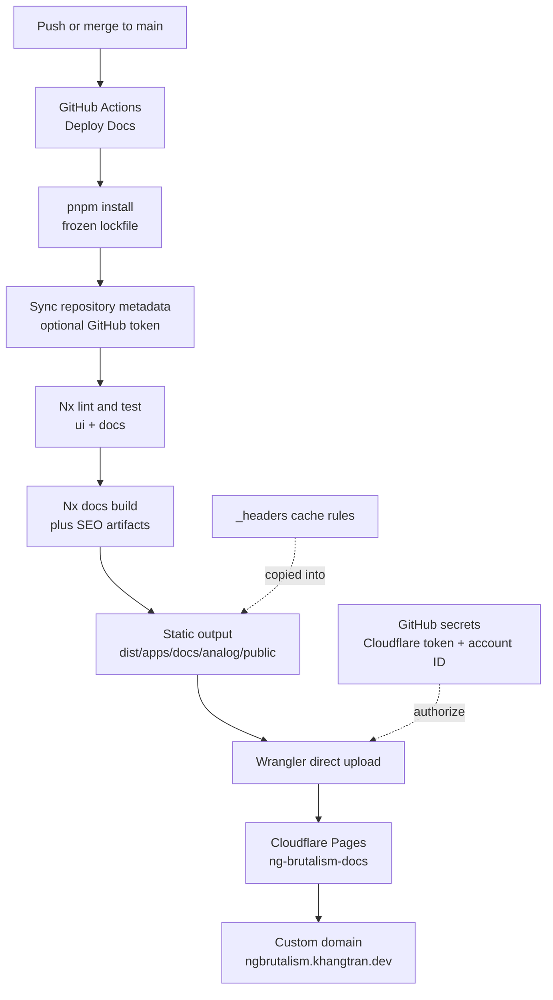

# Docs Deployment

`apps/docs` is deployed to Cloudflare Pages at
<https://ngbrutalism.khangtran.dev>.

The production Pages project is `ng-brutalism-docs`. Deploys are built by
GitHub Actions and uploaded to Cloudflare Pages with Wrangler direct upload.
Cloudflare owns the hosting, custom domain, HTTPS, CDN cache behavior, and
runtime response headers.

## Architecture

The deployment flow is:

```text
push to main
  -> GitHub Actions: Deploy Docs
  -> pnpm install
  -> repository metadata sync
  -> Nx lint/test gate
  -> Nx docs production build + SEO artifacts
  -> Wrangler uploads dist/apps/docs/analog/public
  -> Cloudflare Pages serves ngbrutalism.khangtran.dev
```



The workflow lives in `.github/workflows/deploy-docs.yml`.

The deploy command is:

```bash
pnpm nx run docs:build-seo-artifacts
wrangler pages deploy dist/apps/docs/analog/public --project-name=ng-brutalism-docs
```

The `docs:build-seo-artifacts` target depends on the docs build and then writes
`sitemap.xml` and `llms.txt` into the deploy output. The deployable directory is
`dist/apps/docs/analog/public`.

## Why Cloudflare Pages

The docs site moved from GitHub Pages to Cloudflare Pages because GitHub Pages
does not allow this repo to control cache headers for static assets. GitHub
Pages serves assets with a short cache lifetime, which caused repeat visits to
redownload hashed JavaScript and CSS bundles.

Cloudflare Pages supports a `_headers` file in the static output, so this repo
can serve content with cache policy that matches how the files are produced:

- HTML pages revalidate on each visit.
- Hashed assets under `/assets/*` are cached for one year with `immutable`.
- Images and media are cached for one day.

That fixes the cache TTL issue from the Lighthouse audit while keeping the
existing Nx/GitHub Actions quality gate.

## Why Direct Upload

Cloudflare Pages also supports importing a Git repository, but this repo uses
Wrangler direct upload on purpose. GitHub Actions is the single build authority:
it installs the exact pnpm workspace, runs Nx lint/test checks, syncs repository
metadata, generates SEO artifacts, and only then uploads the built static
output.

Using Cloudflare Git integration would require duplicating that logic in
Cloudflare build settings and secrets. Direct upload keeps CI and deploy gating
in one place while still using Cloudflare for hosting and CDN behavior.

## Normal Deploys

For routine docs updates:

1. Merge or push the change to `main`.
2. Wait for the **Deploy Docs** workflow to pass.
3. Open <https://ngbrutalism.khangtran.dev> and smoke-test the changed page.

The workflow runs:

```bash
pnpm sync:repo-metadata
pnpm nx run-many -t lint test --projects=ui,docs
pnpm nx run docs:build-seo-artifacts
```

The site only updates when those checks pass and Wrangler successfully uploads
the static output to Cloudflare Pages.

To deploy without a new commit: GitHub -> Actions -> Deploy Docs -> Run
workflow.

## Required Secrets

GitHub Actions needs these repository secrets:

- `CLOUDFLARE_API_TOKEN`: Cloudflare API token with `Account -> Cloudflare Pages -> Edit`.
- `CLOUDFLARE_ACCOUNT_ID`: Cloudflare account ID for the account that owns
  `ng-brutalism-docs`.
- `REPO_METADATA_TOKEN` or `GH_TOKEN`: optional GitHub token with repository
  administration write access for About/sidebar metadata sync.

The Cloudflare token should not be committed to the repo. If it is rotated,
update the GitHub repository secret with the new value.

## Cloudflare Settings

Cloudflare Pages:

- Project: `ng-brutalism-docs`
- Deploy method: Direct Upload / Wrangler
- Production domain: `ng-brutalism-docs.pages.dev`
- Custom domain: `ngbrutalism.khangtran.dev`

Cloudflare DNS for `khangtran.dev` should route `ngbrutalism.khangtran.dev` to
the Cloudflare Pages project. When the custom domain is configured through
Cloudflare Pages, Cloudflare manages the required DNS record.

Verify DNS:

```bash
dig +short ngbrutalism.khangtran.dev
```

## Cache Headers

Cache policy is defined in `apps/docs/public/_headers`, which is copied into
the build output and read by Cloudflare Pages.

Important rules:

- HTML routes: `Cache-Control: public, max-age=0, must-revalidate, no-transform`
- `/assets/*`: `Cache-Control: public, max-age=31536000, immutable`
- `/robots.txt`: `Cache-Control: public, max-age=0, must-revalidate, no-transform`
- Logo, favicon, Open Graph image, and mascot media:
  `Cache-Control: public, max-age=86400`

`no-transform` prevents Cloudflare Web Analytics automatic setup from injecting
the `static.cloudflareinsights.com/beacon.min.js` script into HTML responses.
Keep the HTML rules route-scoped so hashed assets retain a clean one-year cache
policy.

## Lighthouse Edge Settings

Two Lighthouse findings are controlled by Cloudflare dashboard features rather
than application code:

- **Cloudflare Web Analytics beacon cache TTL.** The repo prevents automatic
  beacon injection by serving HTML with `Cache-Control: no-transform`. If the
  beacon still appears in live HTML after deploy, disable Pages Web Analytics
  automatic setup for the `ng-brutalism-docs` project.
- **`robots.txt` syntax warning.** Keep Cloudflare managed `robots.txt` and
  Content Signals disabled for this zone. Those features prepend
  `Content-Signal` and AI crawler rules before the repo's `robots.txt`, which
  Lighthouse reports as an unknown robots directive.

## Static Routes

The docs app is statically prerendered. Any new page that must work on direct
navigation needs an entry in `prerender.routes` in `apps/docs/vite.config.ts`.

After adding a route, verify locally:

```bash
pnpm nx run docs:build-seo-artifacts
```

Output should include an `index.html` under
`dist/apps/docs/analog/public/<route>/`.

Important existing smoke routes:

- `/`
- `/docs/introduction`
- `/docs/installation`
- `/components/button`
- `/showcase/portfolio`

## GitHub Pages

GitHub Pages is no longer the production host for this site. After confirming a
Cloudflare Pages deployment works, keep GitHub Pages disabled for this repo so
there is only one production deployment path.

`apps/docs/public/CNAME` can remain in the repo because it is harmless on
Cloudflare Pages, but the authoritative custom-domain setting now lives in
Cloudflare Pages.

## Troubleshooting

- **GitHub Actions fails at the Wrangler deploy step.** Confirm
  `CLOUDFLARE_API_TOKEN` and `CLOUDFLARE_ACCOUNT_ID` are set in GitHub Actions
  secrets and that the token has `Cloudflare Pages: Edit` permission.
- **Wrangler says the project does not exist.** Confirm the Cloudflare Pages
  project is named exactly `ng-brutalism-docs`.
- **Custom domain does not load.** Confirm the domain is active under
  Cloudflare Pages -> `ng-brutalism-docs` -> Custom domains.
- **Cache headers are missing.** Confirm `_headers` exists in
  `dist/apps/docs/analog/public` after running `pnpm nx run docs:build-seo-artifacts`.
- **Direct route returns 404.** The route is probably missing from
  `prerender.routes` in `apps/docs/vite.config.ts`. Add it, rebuild, and
  redeploy.
